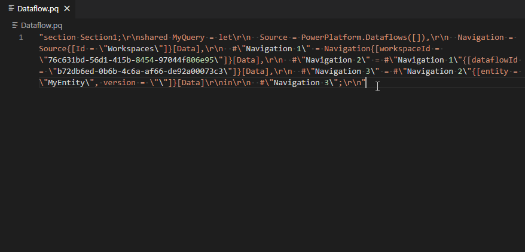

[](https://marketplace.visualstudio.com/items?itemName=PowerQuery.vscode-powerquery)
[](https://marketplace.visualstudio.com/items?itemName=PowerQuery.vscode-powerquery)

# Power Query language service for VS Code

Available in the [Visual Studio Code Marketplace](https://marketplace.visualstudio.com/items?itemName=PowerQuery.vscode-powerquery). Provides a language service for the [Power Query / M formula language](https://powerquery.microsoft.com/) with the following capabilities:

## Fuzzy autocomplete

Suggests keywords, local variables, and the standard Power Query library.


## Hover


## Function hints

Displays function documentation if it exists, and validates the types for function arguments.


## Code formatting

Provides a formatter for the "Format Document" (Alt + Shift + F) command.


## Commands

### String encoding/decoding

These commands can be used to add/remove M and JSON string formatting to/from the currently selected text. This can be helpful when you need to encode an embedded SQL (or other) query in an M expression, or when you're working with files that contain embedded M expressions, such as Power BI Dataflow's [model.json](https://docs.microsoft.com/en-us/common-data-model/model-json) file, and Power Query traces. There is a `powerquery.editor.transformTarget` setting in the extension to choose the target for the operation. `inPlace` (the default) replaces the currently selected text with the updated value. `clipboard` does not change the currently selected text, and puts the transformed text on the clipboard.

These commands require one or more text selections in the active editor window.



| Command                     | Label                                      |
| --------------------------- | ------------------------------------------ |
| powerquery.jsonEscapeText   | Encode selection as JSON string            |
| powerquery.jsonUnescapeText | Remove JSON string encoding from selection |
| powerquery.mEscapeText      | Encode selection as an M text value        |
| powerquery.mUnescapeText    | Remove M text encoding from selection      |

A more specialized version of this command will extract the M Document from an entire model.json/dataflow.json document. This command requires the active document to be recognized as JSON. The result is a new PowerQuery document.

| Command                            | Label                              |
| ---------------------------------- | ---------------------------------- |
| powerquery.extractDataflowDocument | Extract M document from model.json |

## Related projects

-   [powerquery-parser](https://github.com/microsoft/powerquery-parser): A lexer + parser for Power Query. Also contains features such as type validation.
-   [powerquery-formatter](https://github.com/microsoft/powerquery-formatter): A code formatter for Power Query which is bundled in the VSCode extension.
-   [powerquery-language-services](https://github.com/microsoft/powerquery-language-services): A high level library that wraps the parser for external projects, such as the VSCode extension. Includes features such as Intellisense.

## How to build

1. install dependencies:

```cmd
npm install
```

2. build all packages:

```cmd
npm run build
```

## How to run command line tests

1. Generate extension webpack (required for UI tests):

```cmd
npm run webpack-prod
```

2. Run both client (UI) and server tests:

```cmd
npm run test
```

Tests can also be run through VS Code using the different debug profiles.

-   `Language UI Test`: client tests (equivalent of running `npm run test:client`)
-   `Run server unit tests`: server tests (equivalent of running `npm run test:server`)

## Generate vscode extension

Install the [vsce](https://code.visualstudio.com/api/working-with-extensions/publishing-extension) CLI utility.

```cmd
npm install --global vsce
```

Generate vsix package:

```cmd
vsce package
```

## Contributing

This project welcomes contributions and suggestions. Most contributions require you to agree to a
Contributor License Agreement (CLA) declaring that you have the right to, and actually do, grant us
the rights to use your contribution. For details, visit https://cla.microsoft.com.

When you submit a pull request, a CLA-bot will automatically determine whether you need to provide
a CLA and decorate the PR appropriately (e.g., label, comment). Simply follow the instructions
provided by the bot. You will only need to do this once across all repos using our CLA.

This project has adopted the [Microsoft Open Source Code of Conduct](https://opensource.microsoft.com/codeofconduct/).
For more information see the [Code of Conduct FAQ](https://opensource.microsoft.com/codeofconduct/faq/) or
contact [opencode@microsoft.com](mailto:opencode@microsoft.com) with any additional questions or comments.
