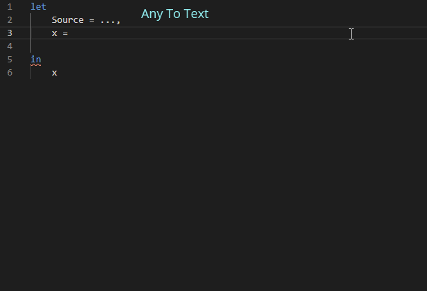
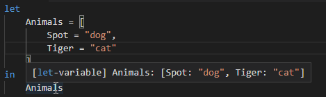
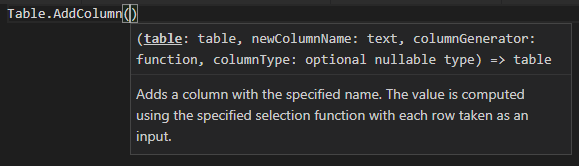
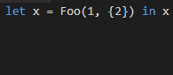

# Power Query language service for VS Code

Available in the [Visual Studio Code Marketplace](https://marketplace.visualstudio.com/items?itemName=PowerQuery.vscode-powerquery). Provides a language service for the [Power Query / M formula language](https://powerquery.microsoft.com/) with the following capabilities:

## Fuzzy autocomplete.



Uses fuzzy matching to suggest autocomplete items for: keywords, local scope, and the standard Power Query library.

## Hover



Hovering over a variable will provide a summary.

## Function hints



When calling a function it provideds the function's documentation if it exists.

## Code formatting



Provides a formatter for the "Format Document" (Ctrl + Shift + F) command.

## Related projects

-   [powerquery-parser](https://github.com/microsoft/powerquery-parser): A lexer + parser for Power Query. Also contains features such as type validation.
-   [powerquery-formatter](https://github.com/microsoft/powerquery-formatter): A code formatter for Power Query which is bundled in the VSCode extension.
-   [powerquery-language-services](https://github.com/microsoft/powerquery-language-services): A high level library that wraps the parser for external projects, such as the VSCode extension. Includes features such as Intellisense.

## How to build

1. install dependencies:

```cmd
npm install
```

2. build all packages:

```cmd
npm run build
```

## How to run command line tests

```cmd
cd server
npm run test
```

There is also a UI test suite that can be run from VS Code.

## Generate vscode extension

Install the [vsce](https://code.visualstudio.com/api/working-with-extensions/publishing-extension) CLI utility.

```cmd
npm install --global vsce
```

Generate vsix package:

```cmd
vsce package
```

## Contributing

This project welcomes contributions and suggestions. Most contributions require you to agree to a
Contributor License Agreement (CLA) declaring that you have the right to, and actually do, grant us
the rights to use your contribution. For details, visit https://cla.microsoft.com.

When you submit a pull request, a CLA-bot will automatically determine whether you need to provide
a CLA and decorate the PR appropriately (e.g., label, comment). Simply follow the instructions
provided by the bot. You will only need to do this once across all repos using our CLA.

This project has adopted the [Microsoft Open Source Code of Conduct](https://opensource.microsoft.com/codeofconduct/).
For more information see the [Code of Conduct FAQ](https://opensource.microsoft.com/codeofconduct/faq/) or
contact [opencode@microsoft.com](mailto:opencode@microsoft.com) with any additional questions or comments.
